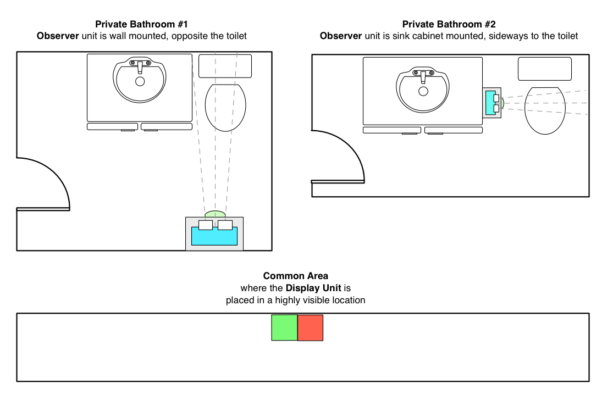
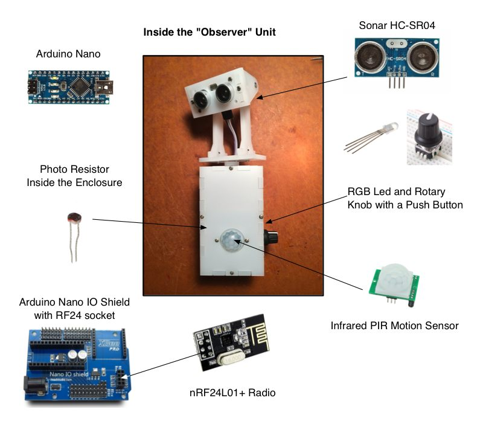
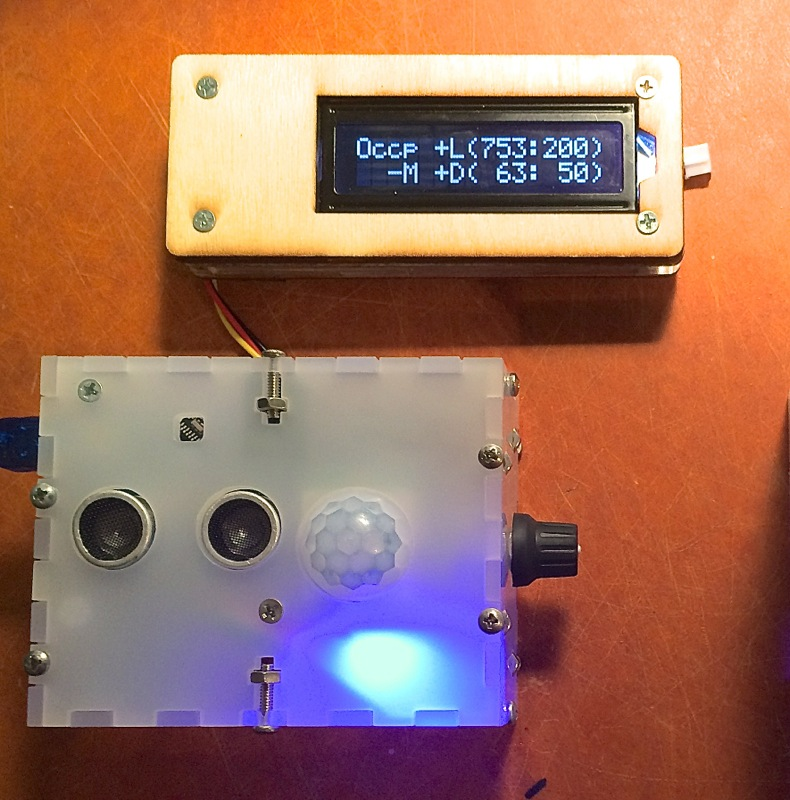
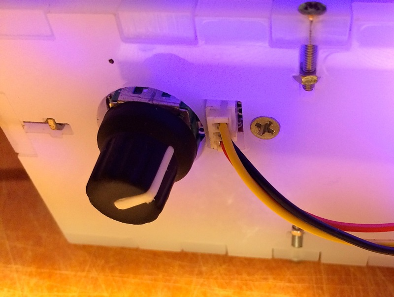

## Occupus

### Goal: minimize pointless waiting – simply know the "right" time to use a shared bathroom in your office. 

Occupus is an Arduino-based toilet occupancy notification system, that uses inexpensive wireless radios (nRF24L01+) to communicate occupancy status of one or more bathrooms, to the main display unit, which would be typically located in a common highly visible area.

> __NOTE__: for a detailed discussion and history of this project, please read corresponding blog post:
> [Occupus: bathroom occupancy status communications technology with Arduino](http://kiguino.moos.io/2014/10/12/Occupus-bathroom-occupancy-wireless-detection-and-notification-with-arduino.html)

Occupus consists of two logical units:

1. Multiple __Observer Units__, installed in each bathroom. They're based on the set of three sensors, a knob, an LCD serial port for on-premises configuration of the unit, and a wireless nRF24L01+ radio card. Up to 5 observer units are supported (this is a limitation of the radio).
2. The __Display Unit__, which uses LED Matrices to display the status of each bathroom occupancy. This unit can be additionally (and optionally) equipped with an Ethernet shield, in which case a small HTTP web server is started. This reports occupancy status over a simple JSON API.
Here is a diagram that explains overall placement and concept.



### Observer Unit

Observers are responsible for communicating a binary status to the display unit: either __occupied__ or __available__. The display unit also has third status: __disconnected__, for each observer unit. But Observers don't have that.

How do Observers determine if the bathroom is occupied? They do so based on the following logic:

1. If the light is off, the bathroom is available
2. If the light is on, we look at the motion sensor - if it detects movement within the last 15 seconds, the bathroom is considered occupied
3. If the motion sensor did not pick up any activity, we then look at the sonar reading.
  * If the sonar (which is meant to be pointed at the toilet) is reading a distance below a given threshold, it means someone is sitting there, and so the bathroom is occupied.
  * Otherwise, it's available.

All settings and thresholds are meant to be tweaked for each bathroom. This is why Observer unit contains Rotary Knob, and a connector for external serial port, meant to be a Serial LCD Display used only to configure the device, but not after.

Below diagram shows components used in the Observer unit installed in each bathroom.



### Display Unit


The _Display_ unit can be certainly implemented in a variety of ways. I chose to use 2 sets of 8x8 LED Matrices, each attached to a Rainbowduino, programmed with _DisplayLED_ sketch.  Additional Arduino Uno (which acts as the master for the Rainbowduinos) listens on the wireless network notifications, and based on this information sends one of three possible states to each of the Rainbowduino units (which are assigned to rooms). Possible states are:

1. Observer for this room is not connected or down (running pixels animation across the screen)
2. Observer is connected, and the room is unoccupied (green "lava-lamp" like texture animation)
3. Observer is connected, and the room is occupied (similar to green, but red)

Finally, an optional (but relatively expensive) Ethernet Arduino Shield can additionally serve the status of the occupancy data as a JSON hash over HTTP.  When installed, an HTTP server is started at boot, and responds to the requests about twice per second.


## How to Use

Here is a general timeline of how you would implement this sort of system:

1. Fork the source code of this repo
2. Assemble at least one Observer Unit.  Feel free to replace the definitions in modules.h with your own, and map them to the pins of your preference.
3. Assemble the most basic Display unit (you can use a couple of LEDs instead of Rainbowduinos to get it working, that's what I did first)
4. Load "Display" sketch into the display unit, and Observer sketch into the Observer unit.
5. Start them up
  - If the LED light on the Observer is blinking red, it means that the Observer is not able to connect to the Display unit. Make sure the connections are right: the reason I chose to use Nano Shield is because RF24 uses 7 pins and I kept mixing them up.
6. If they are working, you should be able to see the status of your "bathroom" in the Serial monitor of your Arduino IDE, as well as the status of each Observer unit as printed to Serial monitor by the Display unit.
7. Press the rotary knob once to start the configuration process. Your Serial Monitor window will be necessary for seeing the values of your configuration parameters.
  - Alternatively, purchase a [16x2 Serial LCD display](https://www.sparkfun.com/products/9395), and make sure to map the pin correctly in your sketch.  This will allow you to see configuration menu and values without having to reconnect Serial Monitor on your computer.
8. Eventually you will complete configuration and will have an option to save config (or not), and to stop the radio (or not).  All settings (except radio status) are saved to EEPRom of your Arduino card.
9. Tweak thresholds in the configuration so that they make sense: e.g. light threshold should be so that when light goes on/off the reading goes above and below the threshold.

### Software Dependencies

Firmware depends on [several simple libraries](https://github.com/kigster/Kiguino/tree/master/libraries), packaged under the [Kiguino Project](https://github.com/kigster/kiguino), and are written to encapsulate access to the sensors, which are all available in another repo, that should be installed into your Arduino libraries folder first.

Here is the full set of dependencies:

Arduino Libs

* SoftwareSerial (output state and options to Serial LCD)
* SPI (communications between components)

3rd Party Libs

* [EEPROMEx](http://playground.arduino.cc/Code/EEPROMex)
* [Encoder](http://www.pjrc.com/teensy/td_libs_Encoder.html)
* [NewPing](https://code.google.com/p/arduino-new-ping/) (for HC-SR04)
* [nRF24L01(+)](http://maniacbug.github.io/RF24/) 2.4GHz Wireless Transceiver
* [SimpleTimer](https://github.com/jfturcot/SimpleTimer) (for timers and callbacks)

Kiguino Libs: these are all available here [https://github.com/kigster/Kiguino/](https://github.com/kigster/Kiguino/)

* RotaryEncoderWithButton (high level rotary encoder abstraction)
* Sonar (wrapper around NewPing)
* LightSensor
* MotionSensor
* SparkfunSerialLCD (wrapper around SoftwareSerial)

Display Unit may also optionally depend on

* Ethernet library

## Configuration and Assembly

Because all thresholds are extremely room and environment specific, Observer modules should be equipped with a [Rotary Encoder Knob](http://www.adafruit.com/products/377) (this particular model incorporates a click button, but you can install an extra button if your rotary knob doesn't have one). Using the button, the user can enter a special configuration mode, and tweak all the settings.

To make changes visible to the user of the Observer module, one must have a Serial LCD display to show the feedback and new values. We found Sparkfun LCD to be very easy to use and reliable, and I have been convering most of my Arduino projects to report status data on that serial port.  Very useful!

Here is a picture of one of the observer units attached to a debugging console (16x2 LCD Matrix), which is communicated with via a Serial cable.  The LCD matrix is optional and can be plugged in/out at any time.





### Config Menu

The settings that can be changed are (and are cycled through by pressing the button):

1. _Light sensitivity_ (between 0 and 1023): A light reading below the threshold will be considered "dark" and will render the overall status as "unoccupied".
2. _IR Sensor Delay_: This is a delay in milliseconds that "blocks" any reading of the motion sensor after any change was detected (this is so that it does not flicker). Typically set to 5000ms, it means that once motion is detected, the motion sensor reading is considered positive regardless of what the sensor actually reports.
3. _Sonar Distance_ (in cm): A distance threshold is used to decide if sonar is detecting someone or not. Values less than the threshold are positive (occupied), while larger values than the threshold are negative (unoccupied).
4. _Exit Timout_ (in seconds): If the light was left on, and we detected occupancy, but no longer do – how long should we consider the room still occupied?  If you make this number too small, the overall status will flicker as various sensors are triggered, but are then released. Setting this to 10-30 seconds is reasonable.  Remember, if the person using the bathroom turns off the light, the timeout is not used.
5. _Save Settings?_ Defaults to NO, but if YES is chosen, parameters are saved to EEPROM, so even if the unit reboots they persist and are used moving forward by that unit.
6. _Disable Radio?_ Sometimes it's convenient to configure the sensors alone, without the unit attempting to connect to the mothership (the display unit).  Set that to YES and radio will temporarily deactivate. This is not saved to EEPROM.

## Observer and Display Unit Design and Assembly


You can read about laser-cut designs I built for Occupus on the blog post [Occupus: bathroom occupancy status communications technology with Arduino](http://kiguino.moos.io/2014/10/12/Occupus-bathroom-occupancy-wireless-detection-and-notification-with-arduino.html).

### In The Wild

On the right is Occupus Display Unit at [WaneloHQ](http://wanelo.com/).


### Debugging Curl Session

```
curl -v http://172.16.0.90/ --header 'Content-Type: application/json' --header 'Accept: application/json'

> GET / HTTP/1.1
> User-Agent: curl/7.30.0
> Host: 172.16.0.90
> Content-Type: application/json
> Accept: application/json
>
< HTTP/1.1 200 OK
< Content-Type: application/json
< Accept: application/json
< Connection: close
< Refresh: 3
<
[{
	"id": 1,
	"connected": true,
	"status": false
}, {
	"id": 2,
	"connected": false
}]
```

## License

All software, sketches, and the box-cutting designs are distributed under the The MIT License (MIT).

## Contributing

I would love to accept ideas and contributions from others!  Please follow standard Github process, as described below.

1. Fork it
2. Create your feature branch (`git checkout -b my-new-feature`)
3. Commit your changes (`git commit -am 'Added some feature'`)
4. Push to the branch (`git push origin my-new-feature`)
5. Create new Pull Request

## Author

 * [Konstantin Gredeskoul](http://kiguino.moos.io), [@kig on twitter](http://twitter.com/kig)

