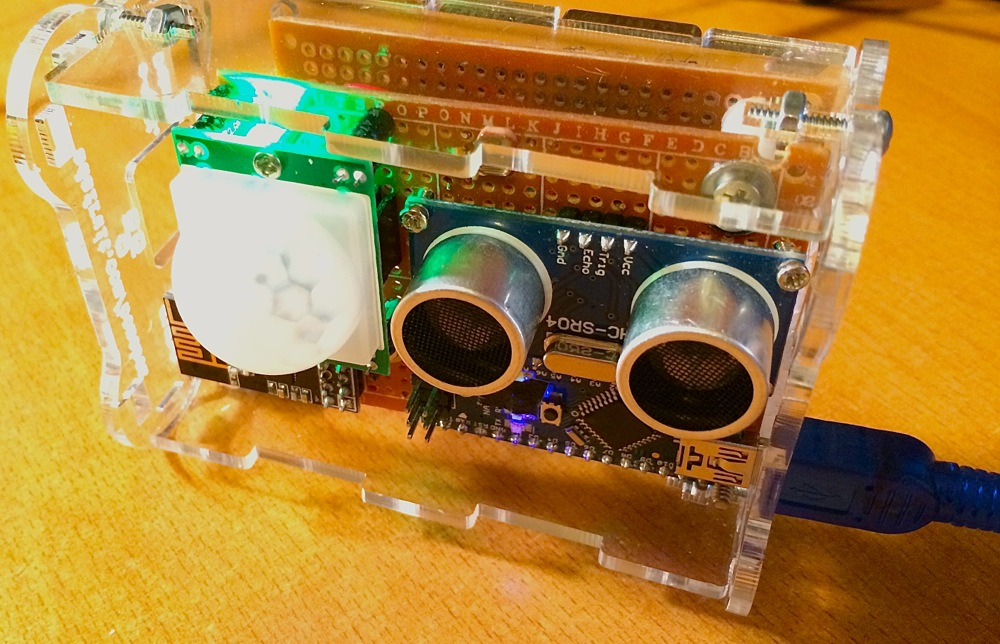
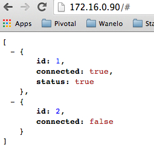

## Potty Occupancy Observation Platform

*Potty Occupancy Observation Platform* (POOP) – is an Arduino-based restroom occupancy detection and rapid notification system based on a network of nRF24L01+ 2.4GHz RF radios. It supports multiple (up to 5) transmitters (bathrooms) and a single receiver (monitor).

This project came out of an actual need to be aware when one of two bathrooms at the new office is occupied. Understanding this status saves people valuable time at work, and allows creative types to stay in the flow until someone, finally, eventually, decides to flush that damn toilet and get the hell out.  No more guessing – which bathroom is free? Is it the one upstairs, or on the 2nd floor?  What about around the corner?

Simply install one of the sensor modules in each bathroom, aiming at the toilet, adjust the Sonar distance parameters, repeat for each other bathroom, and then install a single monitor in a common well visible place.

## Sensor Module

Here is a prototype Sensor Module in action.

## Display Module

Display module has ability to provide status over the TCP/IP network. Using Ethernet Arduino Shield
we are able to run a small HTTP server that serves JSON.

## Contributing

1. Fork it
2. Create your feature branch (`git checkout -b my-new-feature`)
3. Commit your changes (`git commit -am 'Added some feature'`)
4. Push to the branch (`git push origin my-new-feature`)
5. Create new Pull Request

## Author

Konstantin Gredeskoul, @kig, http://github.com/kigster
