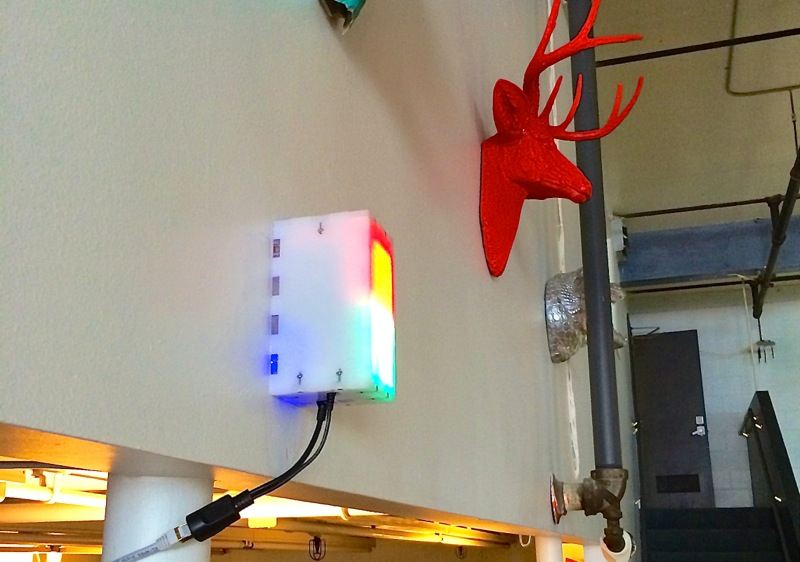

## Bathroom Occupancy Remote Awareness Technology (BORAT)

BORAT is an Arduino-based toilet occupancy notification system, that uses inexpensive wireless radios (nRF24L01+) to communicate occupancy status of one or more bathrooms, to the main display unit, which would be typically located in a common highly visible area.

Therefore BORAT consists of two logical units:

1. __Observer Unit__, installed in each bathroom, is based on the set of three sensors, a knob and an LCD serial port for on-premises configuration of the unit, and a wireless nRF24L01+ radio card.  Up to 5 observer units are supported (this is a limitation of the radio).
2. The __Display Unit__, which uses LED Matrices to display status of each bathroom occupancy. This unit can be additionally (and optionally) equipped with an Ethernet shield, in which case a small HTTP web server is started, and reports occupancy status over a simple JSON API.

Here is a diagram that explains overall placement and concept.


The _Display_ unit can be certainly implemented in a variety of ways. I chose to use 2 sets of 8x8 LED Matrices, each attached to a Rainbowduino, programmed with _DisplayLED_ sketch.  Additional Arduino Uno (which acts as the master for the Rainbowduinos) listens on the wireless network notifications, and based on this information sends one of three possible states to each of the Rainbowduino units (which are assigned to rooms). Possible states are:

1. Observer for this room is not connected or down (running pixels animation across the screen)
2. Observer is connected, and the room is unoccupied (green "lava-lamp" like texture animation)
3. Observer is connected, and the room is occupied (similar to green, but red)

Finally, an optional (but relatively expensive) Ethernet Arduino Shield can additionally serve the status of the occupancy data as a JSON hash over HTTP.

Below diagram shows components used in the Observer unit installed in each bathroom.


### Cost Factor


You may notice some of the components of this projects are not cheap. Since I was not planning on mass producing BORAT, I wanted to assemble just a few units in the easiest way possible. You can most certainly save a lot of money by replacing some of the components with cheaper alternatives.  For example, Rainbowduinos with LED Matrix Displays were at least $50 (for 2), but in my opinion the end result is way worth it.

## How to Use

Here is a general timeline of how you would implement this sort of system:

1. Fork the source code of this repo
2. Assemble at least one Observer Unit.  Feel free to replace the definitions in modules.h with your own, and map them to the pins of your preference.
3. Assemble the most basic Display unit (you can use a couple of LEDs instead of Rainbowduinos to get it working, that's what I did first)
4. Load "Display" sketch into the display unit, and Observer sketch into the Observer unit.
5. Start them up
  - If the LED light on the Observer is blinking red, it means that the Observer is not able to connect to the Display unit. Make sure the connections are right: the reason I chose to use Nano Shield is because RF24 uses 7 pins and I kept mixing them up.
6. If they are working, you should be able to see the status of your "bathroom" in the Serial monitor of your Arduino IDE, as well as the status of each Observer unit as printed to Serial monitor by the Display unit.
7. Press the rotary knob once to start the configuration process. Your Serial Monitor window will be necessary for seeing the values of your configuration parameters.
  - Alternatively, purchase a [16x2 Serial LCD display](https://www.sparkfun.com/products/9395), and make sure to map the pin correctly in your sketch.  This will allow you to see configuration menu and values without having to reconnect Serial Monitor on your computer.
8. Eventually you will complete configuration and will have an option to save config (or not), and to stop the radio (or not).  All settings (except radio status) are saved to EEPRom of your Arduino card.
9. Tweak thresholds in the configuration so that they make sense: e.g. light threshold should be so that when light goes on/off the reading goes above and below the threshold.

### Software Dependencies

Firmware depends on [several simple libraries](https://github.com/kigster/Kiguino/tree/master/libraries), packaged under the [Kiguino Project](https://github.com/kigster/kiguino), and are written to encapsulate access to the sensors, which are all available in another repo, that should be installed into your Arduino libraries folder first.

Here is the full set of dependencies:

Arduino Libs

* SoftwareSerial (output state and options to Serial LCD)
* SPI (communications between components)

3rd Party Libs

* [EEPROMEx](http://playground.arduino.cc/Code/EEPROMex)
* [Encoder](http://www.pjrc.com/teensy/td_libs_Encoder.html)
* [NewPing](https://code.google.com/p/arduino-new-ping/) (for HC-SR04)
* [nRF24L01(+)](http://maniacbug.github.io/RF24/) 2.4GHz Wireless Transceiver
* [SimpleTimer](https://github.com/jfturcot/SimpleTimer) (for timers and callbacks)

Kiguino Libs: these are all available here [https://github.com/kigster/Kiguino/](https://github.com/kigster/Kiguino/)

* RotaryEncoderWithButton (high level rotary encoder abstraction)
* Sonar (wrapper around NewPing)
* LightSensor
* MotionSensor
* SparkfunSerialLCD (wrapper around SoftwareSerial)

Display Unit may also optionally depend on

* Ethernet library

## BORAT Modules

### Observer

Observer module uses three separate sensors to decide if the bathroom is occupied or not:

 * _Light Sensor_: if the light levels are below threshold, no other sensors are checked, and the bathroom is considered unoccupied.
 * _IR Motion Sensor_: if the light is on, motion sensor input is used.  If any movement detected within last 15 seconds, bathroom considered occupied.
 * _Distance Sensor_ (ultrasound): if the light is on, but the motion sensor is not detecting any activity, distance sensor is checked against the configurable distance threshold. If someone is sitting in one position motionlessly the motion sensor would not pick it up, and so the distance sensor can be configured with a specific threshold set to the number of _cm_ exactly in between what the sensor shows with a person sitting there, and without.

Observer units transmit their status to the Display unit via [RF24 wireless module](http://maniacbug.wordpress.com/2011/11/02/getting-started-rf24/).

#### Configuration

Because all thresholds are extremely room and environment specific, Observer modules should be equipped with a [Rotary Encoder Knob](http://www.adafruit.com/products/377) (this particular model incorporates a click button, but you can install an extra button if your rotary knob doesn't have one). Using the button, the user can enter a special configuration mode, and tweak all the settings.

To make changes visible to the user of the Observer module, one must have a Serial LCD display to show the feedback and new values. We found Sparkfun LCD to be very easy to use and reliable, and I have been convering most of my Arduino projects to report status data on that serial port.  Very useful!

Here is a picture of one of the observer units attached to a debugging console (16x2 LCD Matrix), which is communicated with via a Serial cable.  The LCD matrix is optional and can be plugged in/out at any time.


The settings that can be changed are (and are cycled through by pressing the button):

1. _Light sensitivity_ (between 0 and 1023): light reading below the threshold will be considered "dark" and will render the overall status as "unoccupied".
2. _IR Sensor Delay_: this is a delay in milliseconds that "blocks" any reading of the motion sensor after any change was detected (this is so that it does not flicker). Typically set to 5000ms it means that once motion is detected, motion sensor reading is considered as positive for this long regardless of what the sensor actually reports.
3. _Sonar Distance_ (in cm): distance threshold used to decide if Sonar is detecting someone or not.  Values less than threshold are positive (detect), large than threshold are negative (unoccupied).
4. _Exit Timout_ (in seconds): if the light was left on, and we detected occupancy, but no longer do – how long should we consider the room still occupied?  If you make this number too small, the overall status will flicker as various sensors are triggered, but then released. Setting this to 10-30 seconds is reasonable.  Remember, if bathroom user turns off the light, the timeout is not used.

When you exit configuration menu by clicking the knob button, values are saved to EEPROM, so even if the unit reboots they persist and are used moving forward by that unit.

#### Observer Module Design and Enclosure

I built three separate Observer modules, the first two of them had Sonar built into the laser-cut enclosure, so to aim Sonar you would have to move the entire enclosure.

Since it is not practical to be tilting or leaning the enclosure itself, the 3rd design moved the Sonar sensor on top of the box, using an arm that allowed movement in all three degrees of freedom. This design is clearly more flexible.

The Adobe Illustrator files inside the enclosure folder contain designs for the boxes and the arm that I used to cut out the parts on the laser cutter.

__Early Boxes with a Fixed Sonar__

* [First Version – Single PCB](images/module-observer/Observer-Final-SinglePCB-HandMade.jpg). This design does not allow to replace parts easily, as they were all soldered in.
* [Second Version - Modular Design](images/module-observer/Observer-Final-Nano-Shield.jpg), about 2x larger, but modular (all components are connected via cables), and using the Nano Shield with the RF24 breakout.
* [Retro 70s Version :)](images/module-observer/Observer-WoodenPanel-Prototype.jpg)

__Flexible Arm Designs__

* [Module 3 with flexible Sonar arm](images/module-observer/Observer-Module-3-Front.jpg)
* [Slightly longer version of the arm, allows more angles](images/module-observer/Observer-Module-3.jpg)
* [Side view](images/module-observer/Observer-Module-3-Side.jpg)

## Display Module


Primary way the display unit informs users is via two sets of LED Matrices, shown below. I've assembled them by stacking as follows:

1. Arduino Uno
2. Ethernet Shield
3. Prototype Shield with connections leading to pins. Components are then connected via cables.

The entire stack is standing on top of two Rainbowduinos, connected together, using plastic spacers (which I glued to Rainbowduino).

* [Lit up version on my desk](images/module-display/DisplayUnit-0.jpg)
* [Top view](images/module-display/DisplayUnit-2.jpg)
* [Side with connections](images/module-display/DisplayUnit-3.jpg)
* [Next to the box](images/module-display/DisplayUnit-4.jpg)
* [My terrible soldering job :)](images/module-display/DisplayUnit-5.jpg)

Each matrix is driven by a Rainbowduino, and a serial connection is used from Arduino UNO, to the first Rainboduino, then to the second one.

### TCP/IP

Reporter module has ability to provide status over the TCP/IP network. Using Ethernet Arduino Shield
we are able to run a small HTTP server that serves JSON.


### In The Wild

A couple additional photos showing the system in action on the wall at Wanelo HQ.



### Curl Session

```
curl -v http://172.16.0.90/ --header 'Content-Type: application/json' --header 'Accept: application/json'

> GET / HTTP/1.1
> User-Agent: curl/7.30.0
> Host: 172.16.0.90
> Content-Type: application/json
> Accept: application/json
>
< HTTP/1.1 200 OK
< Content-Type: application/json
< Accept: application/json
< Connection: close
< Refresh: 3
<
[{
	"id": 1,
	"connected": true,
	"status": false
}, {
	"id": 2,
	"connected": false
}]
```

## License

All software, sketches, and the box-cutting designs are distributed under the The MIT License (MIT).

## Contributing

I would love to accept ideas and contributions from others!  Please follow standard Github process, as described below.

1. Fork it
2. Create your feature branch (`git checkout -b my-new-feature`)
3. Commit your changes (`git commit -am 'Added some feature'`)
4. Push to the branch (`git push origin my-new-feature`)
5. Create new Pull Request

## Author

 * [Konstantin Gredeskoul](http://kiguino.moos.io), [@kig on twitter](http://twitter.com/kig)

