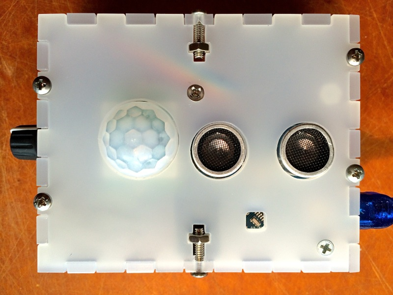
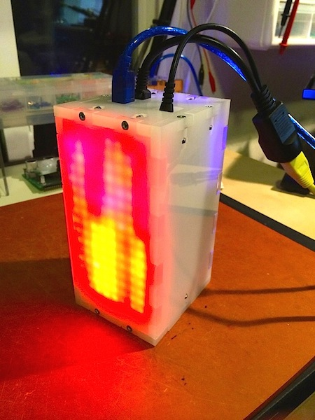
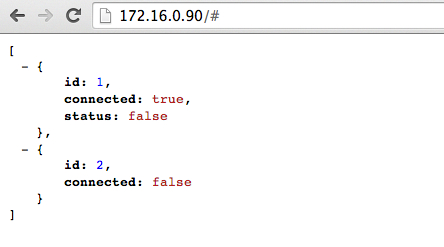
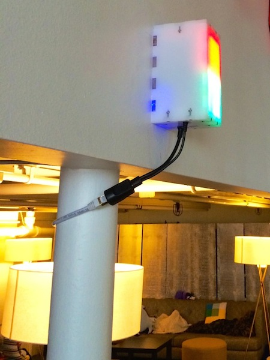
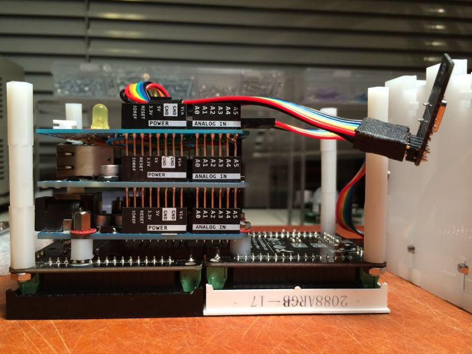
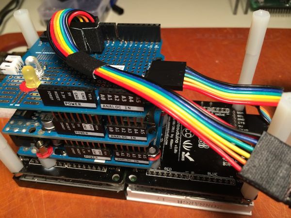
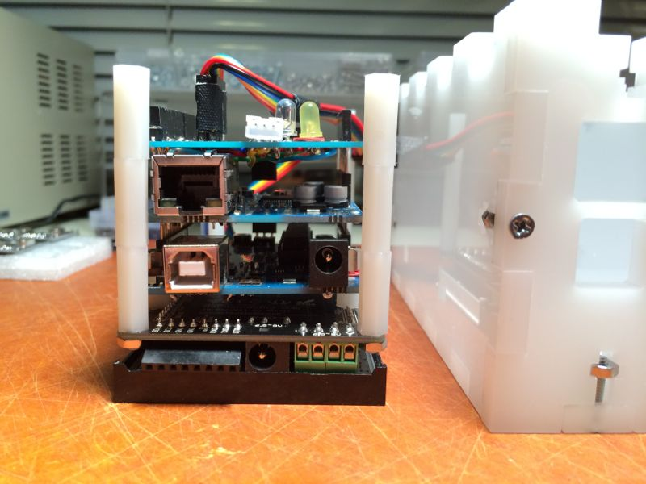
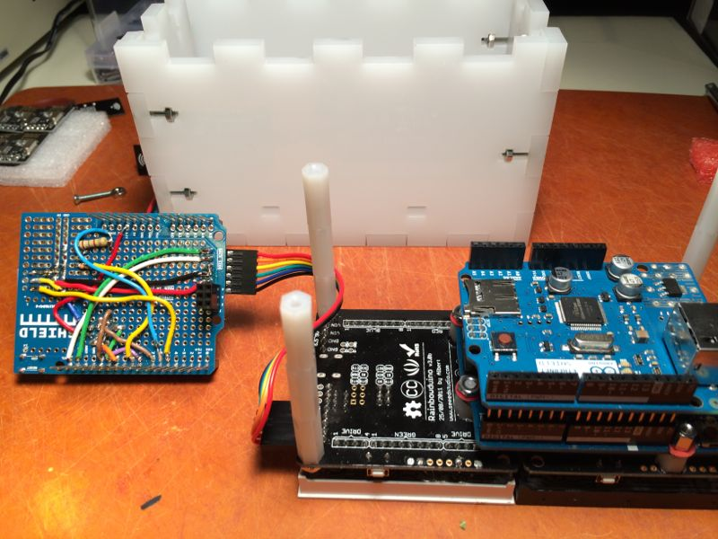
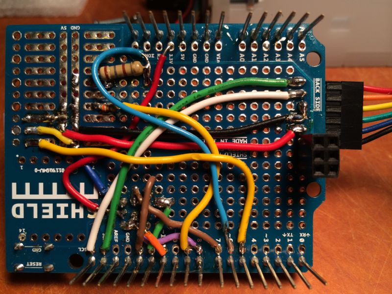
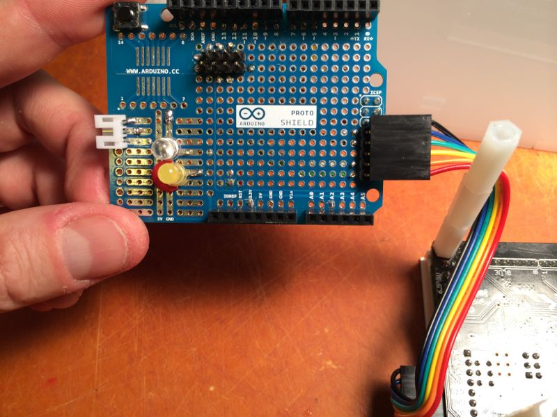

## Bathroom Occupancy Remote Awareness Technology (BORAT)

BORAT is an Arduino-based bathroom/toilet occupancy detection, and wirelss notification system based on a network of nRF24L01+ 2.4GHz RF radios, and a combination of sensors. It supports up to 5 _Observer_ units installed typically in each bathroom, and a single display unit – used to monitor the occupancy status remotely.  The _Display_ unit can be implemented in a variety of way of course. I chose to use 2 sets of 8x8 LED Matrices, each attached to a Rainbowduino, programmed with _DisplayLED_ firmware, to switch between serveral modes of animation depending on the data received via a Serial interface from the primary Arduino (UNO). Finally, an optional (but expensive) Ethernet Arduino Shield can additionally serve the status of the occupancy data as a JSON hash over HTTP.

### Motivation

This project was conceived of the actual need to know when one or both bathrooms at our new office are occupied. Understanding this status saves people valuable time at work, and allows creative types to stay in the flow until someone, finally, eventually, decides to flush that damn toilet and get the hell out :^)  No more guessing – which bathroom is free? Is it the one upstairs, or on the 2nd floor?  What about around the corner?

### Installation Instructions

Simply install one of the sensor modules in each bathroom, aim Sonar sensor at the toilet, adjust the Sonar distance parameters using rotary knob, then repeat for each other bathroom, and then install the display unit in a common well visible place.  Optionally, write a web app that pulls JSON http server, and provides you with a rolling average of your office toilet time :)

### Software Dependencies

Firmware depends on [several simple libraries](https://github.com/kigster/Kiguino/tree/master/libraries), packaged under the [Kiguino Project](https://github.com/kigster/kiguino), and are written to encapsulate access to the sensors, which are all available in another repo, that should be installed into your Arduino libraries folder first.

Here is the full set of dependencies:

Arduino Libs

* SoftwareSerial (output state and options to Serial LCD)
* SPI (communications between components)

3rd Party Libs

* EEPROMEx (for saving configuration to non-volatile RAM)
* Encoder (using rotary encoder for config)
* NewPing (for HC-SR04)
* nRF24L01(+) 2.4GHz Wireless Transceiver
* SimpleTimer (for timers and callbacks)

Kiguino Libs [https://github.com/kigster/Kiguino/](https://github.com/kigster/Kiguino/)

* RotaryEncoderWithButton (high level rotary encoder abstraction)
* Sonar (wrapper around NewPing)
* LightSensor
* MotionSensor
* SparkfunSerialLCD (wrapper around SoftwareSerial)
 
Display Unit may also optionally depend on 
* Ethernet library

## BORAT Modules

### Observer

Observer module uses three separate sensors to decide if the bathroom is occupied or not:

 * _Light Sensor_: if the light levels are below threshold, no other sensors are checked, and the bathroom is considered unoccupied.
 * _IR Motion Sensor_: if the light is on, motion sensor input is used.  If any movement detected within last 15 seconds, bathroom considered occupied.
 * _Distance Sensor_ (ultrasound): if the light is on, but the motion sensor is not detecting any activity, distance sensor is checked against the configurable distance threshold. If someone is sitting in one position motionessly the motion sensor would not pick it up, and so the distance sensor can be configured with a specific threshold set to the number of _cm_ exactly in between what the sensor shows with a person sitting there, and without.

Observer units transmit their status to the Display unit via [RF24 wireless module](http://maniacbug.wordpress.com/2011/11/02/getting-started-rf24/).

#### Configuration

Because all thresholds are extremely room and environment specific, Observer modules should be equipped with a [Rotary Encoder Knob](http://www.adafruit.com/products/377) (this particular model incorporates a click button, but you can install an extra button if your rotary knob doesn't have one). Using the button, the user can enter a special configuration mode, and tweak all the settings.

To make changes visible to the user of the Observer module, one must have a Serial LCD display to show the feedback and new values. We found Sparkfun LCD to be very easy to use and reliable, and I have been convering most of my Arduino projects to report status data on that serial port.  Very useful!

Here is a picture of one of the observer units attached to a debugging console (16x2 LCD Matrix), which is communicated with via a Serial cable.  The LCD matrix is optional and can be plugged in/out at any time.

.

The settings that can be changed are (and are cycled through by pressing the button):

1. _Light sensitivity_ (between 0 and 1023): light reading below the threshold will be considered "dark" and will render the overall status as "unoccupied".
2. _IR Sensor Delay_: this is a delay in milliseconds that "blocks" any reading of the motion sensor after any change was detected (this is so that it does not flicker). Typically set to 5000ms it means that once motion is detected, motion sensor reading is considered as positive for this long regardless of what the sensor actually reports.
3. _Sonar Distance_ (in cm): distance threshold used to decide if Sonar is detecting someone or not.  Values less than threshold are positive (detect), large than threshold are negative (unoccupied).
4. _Exit Timout_ (in seconds): if the light was left on, and we detected occupancy, but no longer do – how long should we consider the room still occupied?  If you make this number too small, the overall status will flicker as various sensors are triggered, but then released. Setting this to 10-30 seconds is reasonable.  Remember, if bathroom user turns off the light, the timeout is not used.

When you exit configuration menu by clicking the knob button, values are saved to EEPROM, so even if the unit reboots they persist and are used moving forward by that unit.

#### Observer Module Desigh

Here is an example of Observer module based on Arduino Nano, and custom soldered components, without any shield:



## Display Module

Primary way the display unit informs users is via two sets of LED Matrices, shown below.



Each matrix is driven by a Rainbowduino, and a serial connection is used from Arduino UNO, to the first Rainboduino, then to the second one.

### TCP/IP

Reporter module has ability to provide status over the TCP/IP network. Using Ethernet Arduino Shield
we are able to run a small HTTP server that serves JSON.



### In The Wild

A couple additional photos showing the system in action on the wall at Wanelo HQ.




### Assembly

Here are a set of pictures that might shed some light into the assembly of the display unit:









### Curl Session

```bash
→ curl -v http://172.16.0.90/ --header 'Content-Type: application/json' --header 'Accept: application/json'

> GET / HTTP/1.1
> User-Agent: curl/7.30.0
> Host: 172.16.0.90
> Content-Type: application/json
> Accept: application/json
>
< HTTP/1.1 200 OK
< Content-Type: application/json
< Accept: application/json
< Connection: close
< Refresh: 3
<
[{
	"id": 1,
	"connected": true,
	"status": false
}, {
	"id": 2,
	"connected": false
}]
```


## Contributing

1. Fork it
2. Create your feature branch (`git checkout -b my-new-feature`)
3. Commit your changes (`git commit -am 'Added some feature'`)
4. Push to the branch (`git push origin my-new-feature`)
5. Create new Pull Request

## Author

Konstantin Gredeskoul, @kig, http://github.com/kigster
