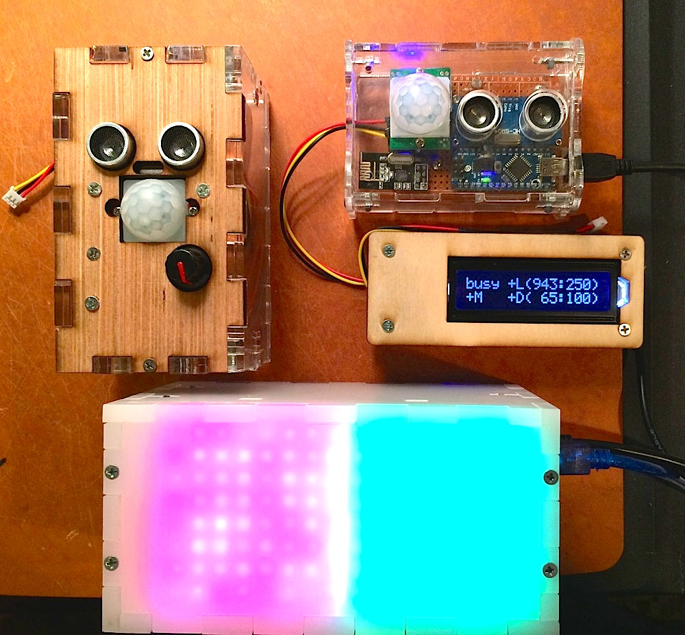
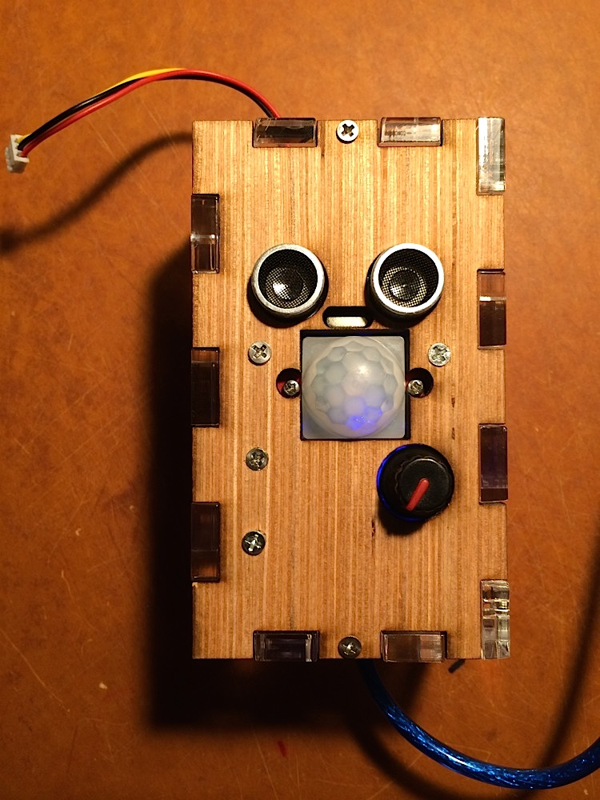
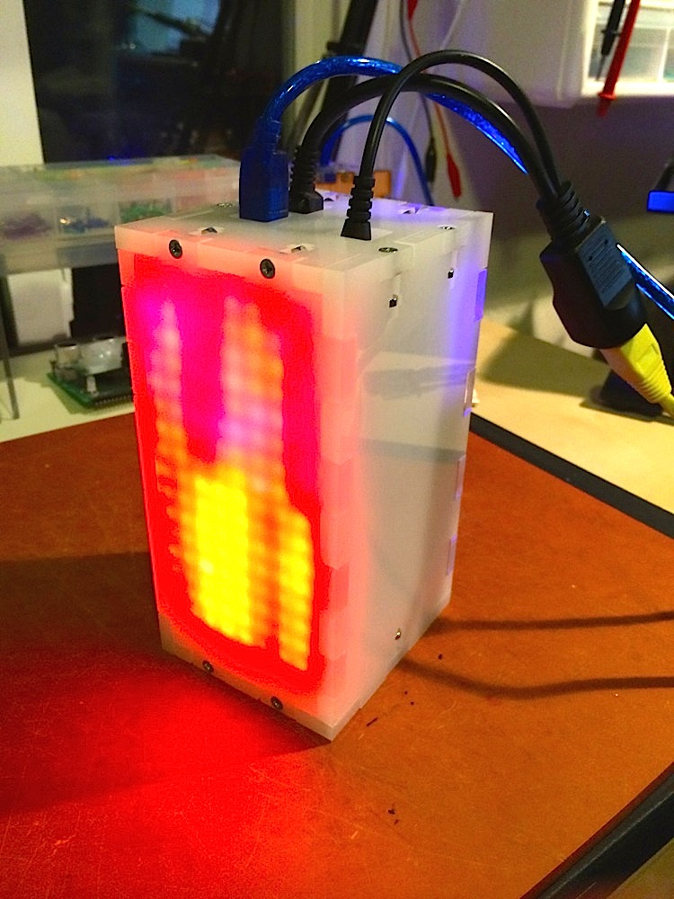

## Bathroom Occupancy Remote Awareness Technology (BORAT)

BORAT is an Arduino-based bathroom/toilet occupancy detection, and wirelss notification system based on a network of nRF24L01+ 2.4GHz RF radios, and a combination of sensors. It supports up to 5 "Observer" units installed typically in each bathroom, and a single display unit – used to monitor the occupancy status remotely.  The "Display" unit can be implemented in a variety of way of course. I chose to use 2 sets of 8x8 LED Matrices, each attached to a Rainbowduino, programmed separately to switch between serveral modes of animation based on the information received via a Serial interface from the main Arduino (UNO).  Finally, an optional (but expensive) Ethernet Arduino Shield can offer serving the status of the occupancy data as a JSON hash over HTTP.

This project came out of the actual need to know when one or both bathrooms at our new office local would be occupied. Understanding this status saves people valuable time at work, and allows creative types to stay in the flow until someone, finally, eventually, decides to flush that damn toilet and get the hell out :^)  No more guessing – which bathroom is free? Is it the one upstairs, or on the 2nd floor?  What about around the corner?

Simply install one of the sensor modules in each bathroom, aim Sonar sensor at the toilet, adjust the Sonar distance parameters using rotary knob, then repeat for each other bathroom, and then install the display unit in a common well visible place.  Optionally, write a web app that pulls JSON http server, and provides you with a rolling average of your office toilet time :)

Below is the picture of all components participating in this function:



## Observer/Sensor Module

I created two modules, which are very similar, but the second unit has more functionality.

### Mechanism

Observer module uses three sensors to decide if the bathroom is occupied or not:

 * Light sensor: if the light levels are below threshold, no other sensors are checked, and the bathroom is considered unoccupied.  
 * IR Motion sensor: if the light is on, motion sensor input is used.  If any movement detected within last 15 seconds, bathroom considered occupied.
 * Distance sensor (ultrasound): if light is on, but motion sensor is not detecting any activity, distance sensor is checked against the configurable threshold. If someone is sitting on the toilet (motionessly), the distance sensor can be configured to recognize distance, by having threshold be the number exactly between what the sensor shows with a person sitting there, and without.

Because all thresholds are extremely room and environment specific, Observer modules I built are configured with a [Rotary Knob](http://www.adafruit.com/products/377) (this particular one incorporates a button, but you can install an extra button if your rotary knob doesn't have one). Using the button, the user can enter configuration mode, and tweak all the settings.


Observer unit transmits it's status to the Display unit via [RF24 wireless module](http://maniacbug.wordpress.com/2011/11/02/getting-started-rf24/).

Next are some pictures of the sensor modules.

#### Early Sensor Module


#### Advanced Sensor Module



This sensor unit has an additional rotary knob (which can be clicked, for a button effect).  I used the knob to provide optional real time configuration interface, which saves all changes to EEPROM.

## Display Module

Primary way the display unit informs users is via two sets of LED Matrices, shown below.



Each is driven by a Rainbowduino, and a serial connection is used from Arduino UNO, to the first Rainboduino, then to the second one.

### TCP/IP

Reporter module has ability to provide status over the TCP/IP network. Using Ethernet Arduino Shield
we are able to run a small HTTP server that serves JSON.


### Curl Session

```bash
→ curl -v http://172.16.0.90/ --header 'Content-Type: application/json' --header 'Accept: application/json'

> GET / HTTP/1.1
> User-Agent: curl/7.30.0
> Host: 172.16.0.90
> Content-Type: application/json
> Accept: application/json
>
< HTTP/1.1 200 OK
< Content-Type: application/json
< Accept: application/json
< Connection: close
< Refresh: 3
<
[{
	"id": 1,
	"connected": true,
	"status": false
}, {
	"id": 2,
	"connected": false
}]
```

## Contributing

1. Fork it
2. Create your feature branch (`git checkout -b my-new-feature`)
3. Commit your changes (`git commit -am 'Added some feature'`)
4. Push to the branch (`git push origin my-new-feature`)
5. Create new Pull Request

## Author

Konstantin Gredeskoul, @kig, http://github.com/kigster
